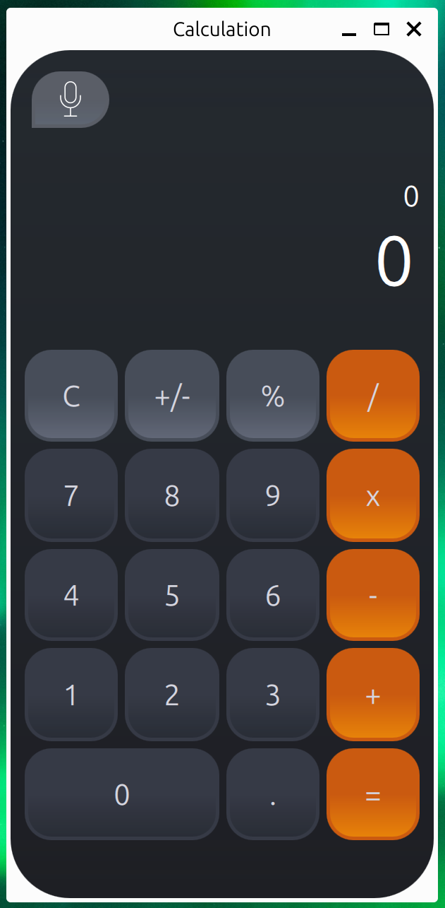

## CalculatorQML
<p align="center">
  
</p>

**Calculator** in **PySide6** and **QML**
This is a simple calculator application developed using PySide6 and QML. The application supports basic arithmetic operations and demonstrates the basic principles of working with PySide6 and QML.

**Requirements:**
- Python 3.10+
- PySide6
- Qml

## Installation
Clone the repository:
```
git clone https://github.com/yourusername/calculator.git
cd calculator
```
Create and activate a virtual environment (optional):

```
python -m venv venv
source venv/bin/activate   # for Windows use venv\Scripts\activate
```
Install the dependencies:
```
pip install -r requirements.txt
```
Run the application with the following command:
```
python calculator.py
```

> **Project Structure CalculatorQML:** 
The calculator.py script to run the application.
calculator.qml - the main QML file describing the calculator interface, 
implementing the calculator logic.

## Build
To assemble the application into one executable file - .exe, you need to follow
the instructions in the Installation section, then:

```
cd scripts
build.*
```
Ttwo folders will appear in the scripts folder: build and dist:
```
scripts\
    build\
    dict\
        calculator.exe
```

## Usage
After starting the application, you will see the calculator interface. Enter 
numbers and choose the necessary operation (+, -, *, /) to perform calculations. Press the "=" button to get the result. The "C" button clears the current expression.

## Testing
To run the tests, use pytest. Ensure that you have pytest and pytest-qt installed.
```
pytest
```

## License
This project is licensed under the GNU General Public License - see the 
LICENSE file for details.
